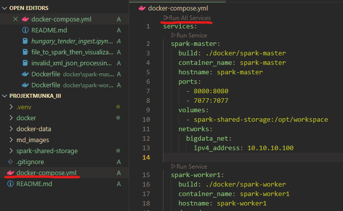
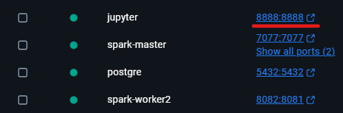

# Hungary Tender Spark pipeline

## How to Run

Before running the project, make sure you have installed [Docker Desktop](https://www.docker.com/products/docker-desktop/).

To run the project I suggest you to use VSCode with Docker extension.

In Docker Destkop you will see a jupyter server click on the port number.

After this use the Jupyter server or VSCode.

If you want to stick with VSCode you should create a virtual environment and intall your depedencies one by one.

## How to Contribute

You should fill two projects with code: [file_to_spark_then_visualization.ipynb](spark-shared-storage/file_to_spark_then_visualization.ipynb) and [invalid_xml_json_processing.ipynb](spark-shared-storage/invalid_xml_json_processing.ipynb)